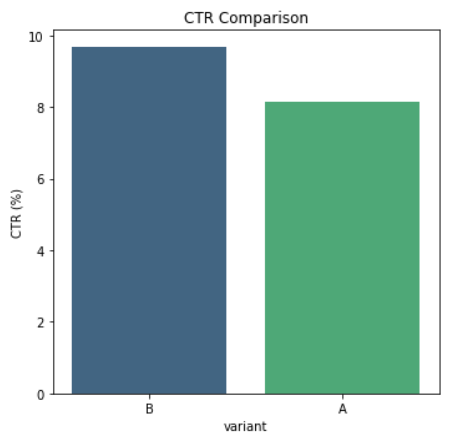
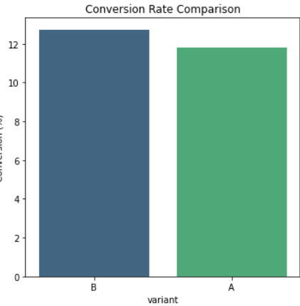

# 📊 A/B Testing in Databricks — EDA + Statistical Significance

A Databricks SQL + Python project analyzing an A/B test dataset to measure and compare:
- Click-Through Rate (CTR)
- Conversion Rate
- Average Revenue per User

## 🚀 Project Highlights
- Data cleaning to remove invalid metrics (e.g., clicks > impressions)
- Metric calculation in Databricks SQL
- Statistical significance testing in Python (Chi-square, t-test)
- Visualization using Matplotlib + Seaborn
- Markdown explanation of A/B testing concepts

## 📂 Repo Structure
See the project files for:
- `notebook/ab_testing_databricks.ipynb` → full code and results
- `images/` → visualizations
- `data/` → optional sample dataset

## 📊 Key Insights
| Metric             | Variant A | Variant B | p-value  | Significant? |
|--------------------|-----------|-----------|----------|--------------|
| CTR%               | 8.15%     | 9.67%     | 0.0000   | ✅ Yes       |
| Conversion%        | 11.81%    | 12.71%    | 0.1565   | ❌ No        |
| Avg Revenue/User   | $218.49   | $280.69   | 0.0000   | ✅ Yes       |

## 📊 Visual Results

### CTR Comparison

### Revenue per User Comparison

### Conversion Rate Comparison

> **Conclusion:** Variant B improves CTR and ARPU significantly, while conversion rate differences are not statistically significant. Recommend rolling out Variant B and monitoring conversion rate over time.

## 🛠 Tech Stack
- **Databricks SQL** → Data preparation & aggregation
- **Python (Pandas, Seaborn, SciPy)** → Statistical testing & visualization
- **Matplotlib** → Charts

## 📄 Author
**Rehan Chaudhry**  
[GitHub Portfolio](https://github.com/rehansc)  
[LinkedIn](https://www.linkedin.com/in/rehanchaudhry/)
